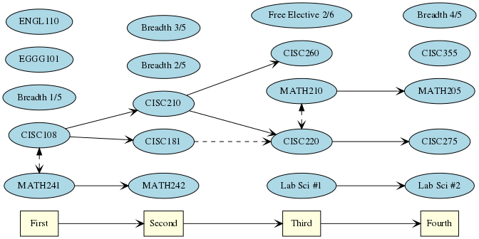

The first four semesters are pretty much the same for everyone.

Whether you major or minor in CS, the need for Software Engineers is so great you are very likely to find a job.

# Problem Solving

Generally, Computer Science is all about problem solving.

# Programming

Programming is how we speak to computers and give them instructions.

# Data Structures and Algorithms

Data is how we represent the world in our computers. When we *abstract* details

Algorithms are series of instructions that modify data.

# Theory

Computer Scientists also think about the theories underlying problem-solving.

# Software Development 

Software Development is at the heart of every Computer Science degree.

